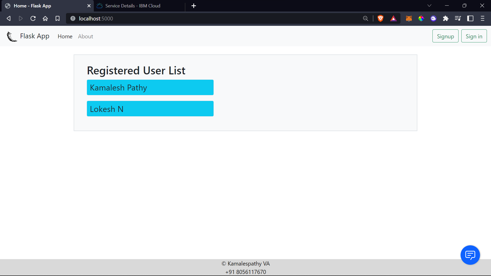
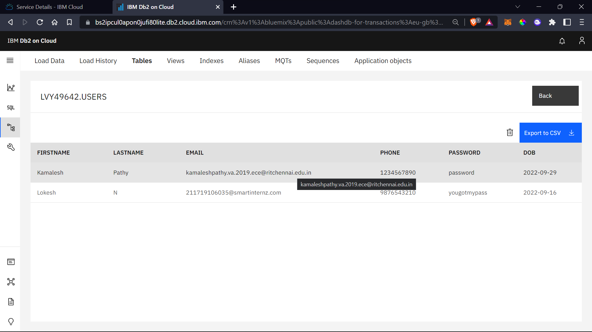
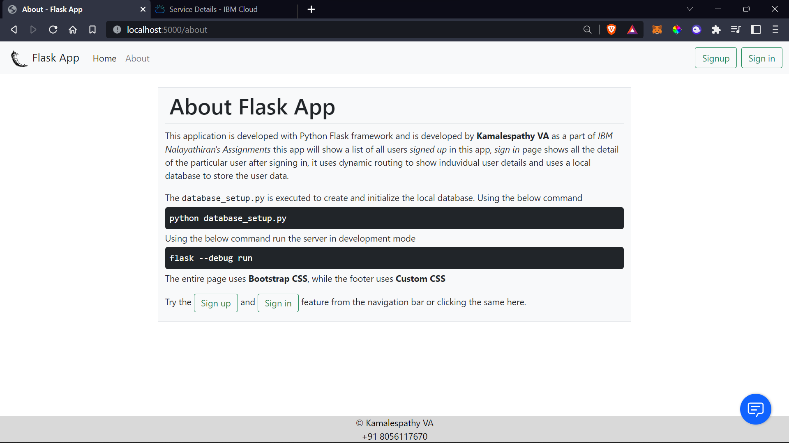
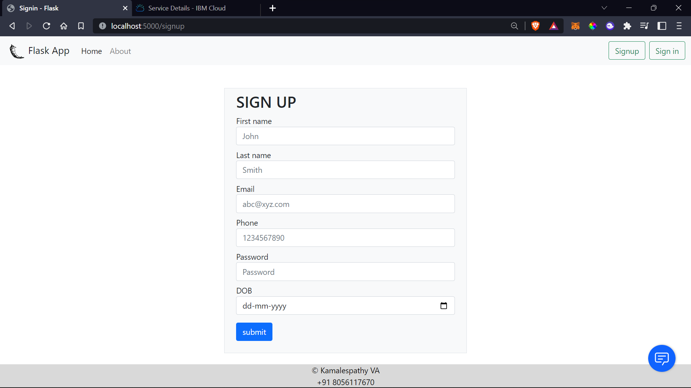
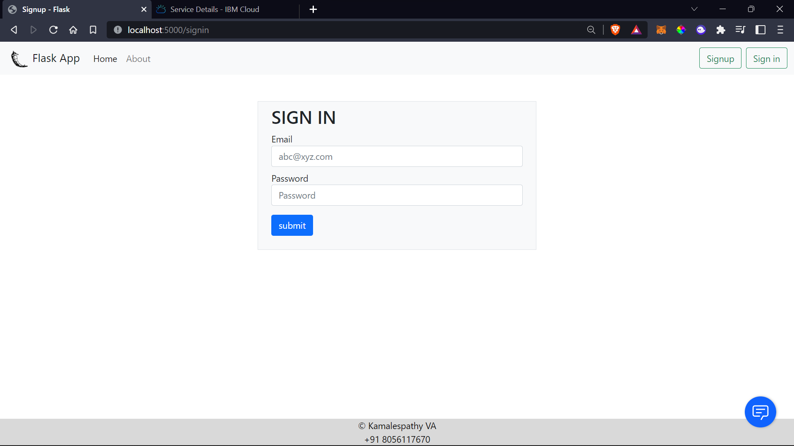
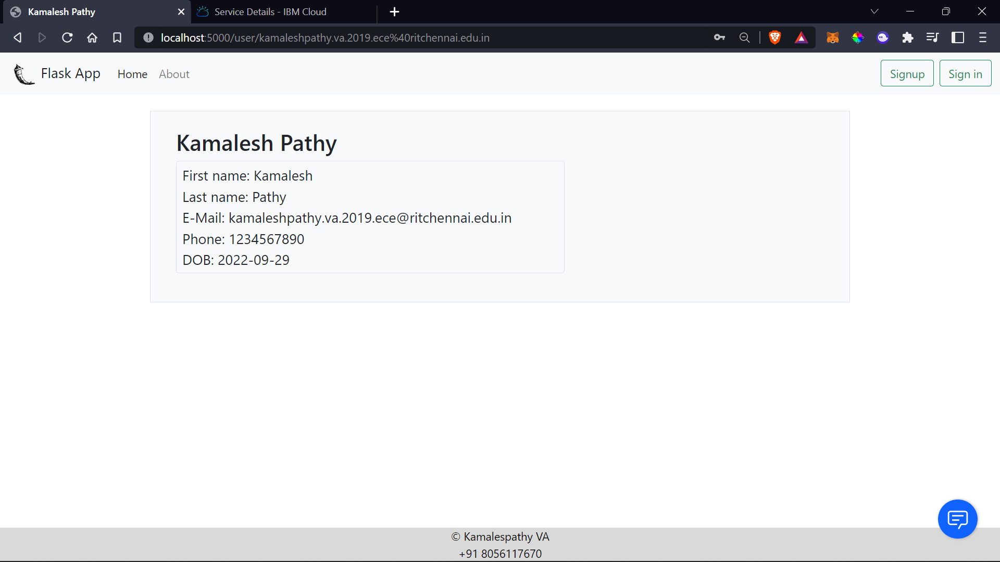

# Flask App with IBM DB2 database

___

This application is developed with Python's Flask framework, uses Bootstrap for CSS
has a home page, about page, sign in page, sign up page, user info page to show the info of the logged in user.

> ___NOTE: To run this application credentials for IBM-DB2 is required, due to security reasons the credentials and the SSL certificate are removed.___  
> Add your credentials to run this on your side.

Run the following command to run the server

```
flask --debug run
```

The flask application will be running on 

```
localhost:5000
```

## Output Screen shots

___

### Home page



> The list of registered useres will be shown in this page, these information are reterived from the IBM-DB2.

### Records on IBM-DB2



### About page



### Sign up page



### Sign in page



### User info page



> This page shows the details of logged in user, the sign in page redirects to this page, this page uses dynamic routes.
