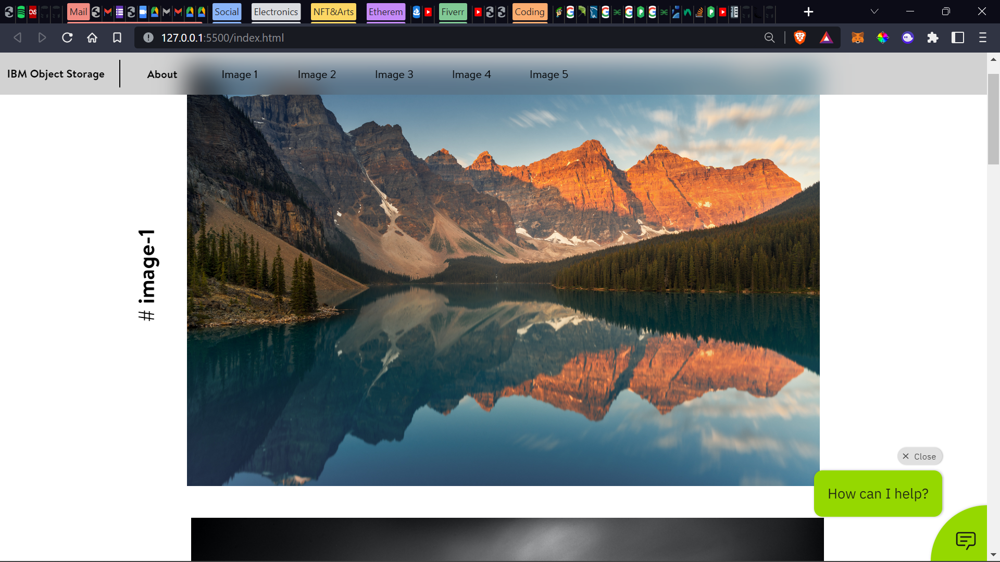
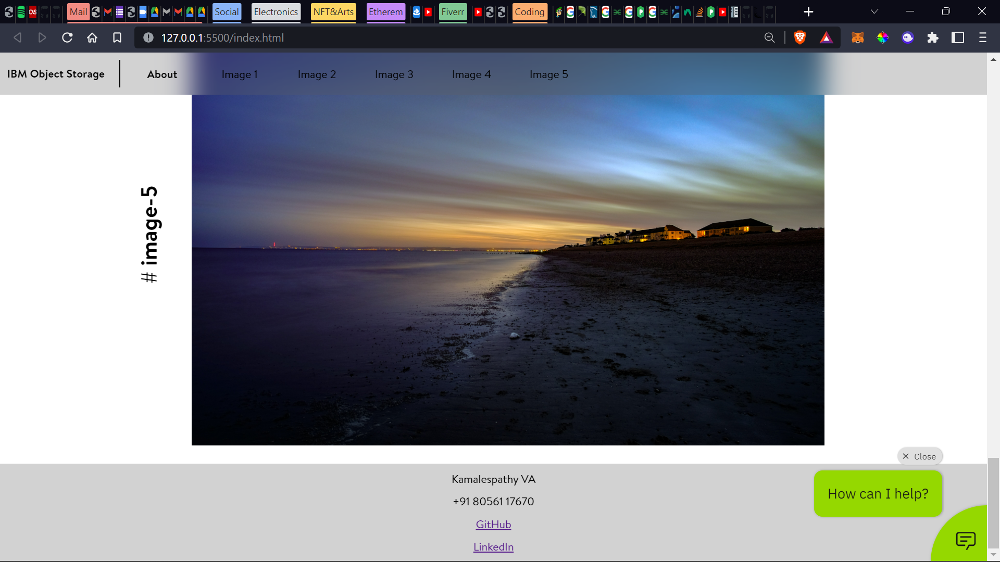

# Assignment 3

____

### Index page

- 5 images are displayed.
- Navbar links to all 5 images within the page

### About page

### Object storage

> The style sheet for index is sourced from this bucket

### Chatbot

[Watson Preview Link](https://web-chat.global.assistant.watson.appdomain.cloud/preview.html?backgroundImageURL=https%3A%2F%2Fjp-tok.assistant.watson.cloud.ibm.com%2Fpublic%2Fimages%2Fupx-ac11097b-5573-4744-9b85-ea74327ddcba%3A%3A9234e475-cea2-4454-8d76-14be5aba4786&integrationID=55600550-2ac7-46fd-85b3-08129a413c12&region=jp-tok&serviceInstanceID=ac11097b-5573-4744-9b85-ea74327ddcba)
